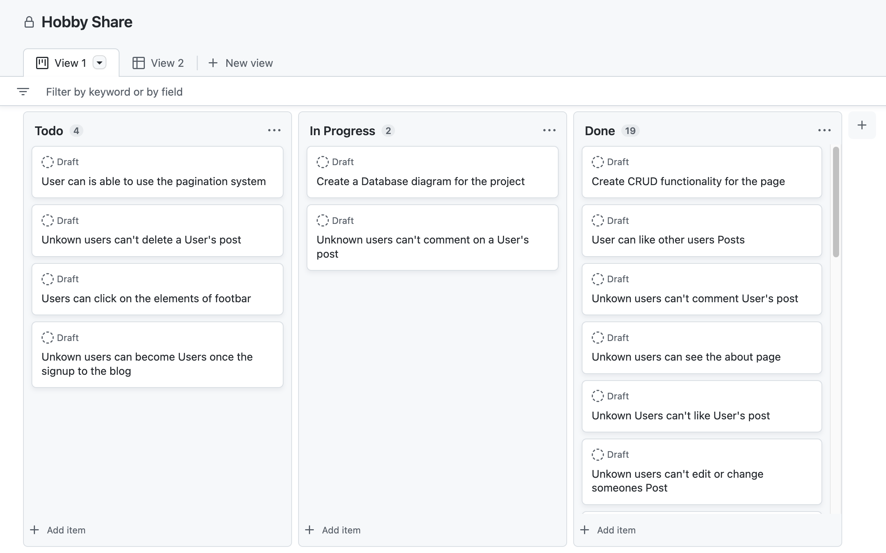

# Hobby Share

Hobby Share is a community where people are able and willing to share their hobbies with others. Likewise it creates a streamline of information for the users to see what categories there are, thus encouraged to feel willing to create, and interact with various of posts from other hobby enthusiasts. Where all the uploaded and inspiring messages are their for peoples disposal. It's a representation of who you are and what interests you represents.  

## Table of Contents

+ [Database Diagram](#database-diagram "Database Diagram")
+ [Design Plan](#Design-plan "Design Plan")

# User stories: 

Evidence that User stories has been applied into the project (old):

### Database Schema

- [Database diagram was made from the interactive site Creately](https://app.creately.com/d/usBCZwL48oY/edit)

# Design Plan:

The design of the Hobby Share changed along the the way but importantly is the outcome and the functions behind the webpage. 

*Disclaimer my knowledge of Balsamiq was limited for this project when it comes to the true present webpage's design. Many Apologies for that.... Both in the plan and final result of the design. 

### Homepage:

The homepage was designed like this because I wanted to create a perfect introdution for the user to feel a sense of welcome once they are visiting the page: 

### Updated & final design: 

### About page: 

In the about page of my design plan I wanted to create a word art where peoples posts coherent with their categories where uploaded here. But some changes where made and I redirected my fokus on wanted to create a regular about page. It became a very one and it could have become better - but it's a representation of what Hobby Share want to signaling with its target audience: 

### Updated & final design: 

### Login Page:

The log-in page hasn't been updated nor changed when it comes to its design. 

### BlogPost:

### Updated & final design: 

### Color Scheme:

# Typography:
All fonts were obtained from the Google font & Bootstrap. I chose the following fonts for the page:

[Bootstrap](https://getbootstrap.com/docs/5.0/content/typography/) & 'Times New Roman', Times, serif: 

- heading/logo, Blog & print titles
- navigation & site buttons [w3schools](https://www.w3schools.com/css/css3_shadows_box.asp)

# Imagery:

All photography for the fictional "posts" from the users, were imported from [Tomi Tokko](https://github.com/tomitokko/django-social-media-website) with [freecodecamp](https://www.freecodecamp.org/) free course on [youtube](https://www.youtube.com/watch?v=xSUm6iMtREA).

Likewise from [Pexels](https://www.pexels.com/). 

# Media 

- [Pexels](https://www.pexels.com/)
- [Main Photo](https://images.pexels.com/photos/5973966/pexels-photo-5973966.jpeg?auto=compress&cs=tinysrgb&w=1600)
- [Blog1 Post](https://images.pexels.com/photos/5644638/pexels-photo-5644638.jpeg?auto=compress&cs=tinysrgb&w=1600)
- [Blog2 Post](https://images.pexels.com/photos/1040157/pexels-photo-1040157.jpeg?auto=compress&cs=tinysrgb&w=1600)

# Features
### Existing Features:

Homepage|Uploaded Posts page: 

Paignation function:

Navigation Bar:

Desktop: 

*Disclaimer, navbar for the mobile phone was unfortunately failed cause the uploaded posts fall off, and that will be changed for later.

About page: 

About page with closed-Accordion:

About page with open-Accordion:

Create Post:

Contact|Support Page:

Profile Page:

Logout Page:

Register Page:

#### Bugs Report

### 1.

## In the file: create_post.html

###   Error
    form class="create-post" id="create_post_form" method="post" action=""

The data wasn't registrated from the form and the images wasn't uploaded to the home page. However, in the database demonstrated from tableplus it was registrated there and as well as in the django administration page. 

### Fixed Error
    form class="create-post" id="create_post_form" method="post" enctype="multipart/form-data" action=""

The issue was resolved by adding the enctype attribute and everything was finally added into the data, which the user was now able to post images related to their blogpost. It was required to have this feature cause without it would create a bad user experience and the purpose of the website wouldn't meet up to its expectations.   

# 2

#### views.py

#### Errors
##### CRUD: 
class CreatePost(View):

    def get(self, request, *args, **kwargs):
        return render(
            request,
            "create_post.html", 
            {
                "form": PostForm()
            },
        )
        

    def post(self, request, *args, **kwargs):

        post_form = PostForm(request.POST)

Related to the issue above in terms of uploading and creating posts, it was unable to pin a image into the your own blog. Thanks to no request.FILES where added in the function. That generated the problems to store data for user's benefit and see were it went. 

## Fixed Error

class CreatePost(View):

    def get(self, request, *args, **kwargs):
        return render(
            request,
            "create_post.html", 
            {
                "form": PostForm()
            },
        )
        

    def post(self, request, *args, **kwargs):

        post_form = PostForm(request.POST, request.FILES)

By added request.FILES in the post form it was finally resolved by adding this missing feature. Once something is missing it creates error and thanks to the documentation from the terminal it gave the path of a good result to determine where the bug was. 

# 3

In the register page of the Hobby Share, it created an error due some issues regards to the settings.py file and that led to some errors along the way of project's process:

- The a new potential user is trying to set up a new account:

- Error message:

## settings.py

### First Issue: 
ACCOUNT_EMAIL_VERIFICATION = False

### First change & failed: 
ACCOUNT_EMAIL_VERIFICATION = True

### Result: 

### Final and solution: 
ACCOUNT_EMAIL_VERIFICATION = 'none'

##### Another error of the CRUD

While working with CRUD function it was some issues to add the delete one, since I was doing the same changes and added the same functions with different attributes, names etc it gave me an error. It send the information on my website: http 405 which meant that no right method has been used and the website crashed. It also was a late night and it led on layers of more issues and a sense of feeling that you were stuck in a loop of bad repetion. 

#### Error:

class PostDelete(View):

    def get(self, request, id, *args, **kwargs):
        post = get_object_or_404(post.id)
        post.delete()

        return HttpResponseRedirect(reverse('home'))
    
##### Fixed Error

    class PostDelete(View):

        def get(self, request, id, *args, **kwargs):
            post = get_object_or_404(Post, id=id)
            post.delete()

            return HttpResponseRedirect(reverse('home'))

# Validator Test

- [Pep8online](http://pep8online.com/) is unfortunately unaccessible at this time, the only source of test I was able to make for this project was look through my terminal or the installed pep8 compliant. (Directed from the Tut support)

-  but it won't affect the workspace nor the function of the code. Because the characters of the text is too long but it the final result is acting as expected, therefore reach up to its goal of this project. 

All html files were passed by [W3C Validator](https://validator.w3.org/)

- Errors that were discovered were the  & {{}} tags. Those are required to make the webpage work. As well as other errors that won't hurt the projects main objective, e.g. "Non-space characters found without seeing a doctype first. Expected". These can be changed but the outcome to make the page work with all its functions is the main goal here. 

- CSS file didn't detect any errors either in [Jigsaw validator](https://jigsaw.w3.org/css-validator/), since I am Swedish and Jigsaw seems to only show messages on my language at this time - (don't know how to change it) - I swear it says that no error are shown in the css file: 

* Hobby Share was demonstraded and portrayed these stats in Lighthouse:

# Credits

- [I think and therefore I blog - Walkthrough Project](https://github.com/Code-Institute-Solutions/Django3blog/tree/master/12_final_deployment) & [Website: ](https://learn.codeinstitute.net/courses/course-v1:CodeInstitute+FST101+2021_T1/courseware/b31493372e764469823578613d11036b/fe4299adcd6743328183aab4e7ec5d13/)
- [Django Blog Application - Full Tutorial 2022](https://www.youtube.com/watch?v=I8TRkEcw9Mg)
- [Django For Everybody - Full Python University Course](https://www.youtube.com/watch?v=o0XbHvKxw7Y)
- [Build a Social Media App with Django – Python Web Framework Tutorial](https://www.youtube.com/watch?v=xSUm6iMtREA)
- [Codemy.com -Create A Simple Django Blog ](https://www.youtube.com/watch?v=B40bteAMM_M&list=PLCC34OHNcOtr025c1kHSPrnP18YPB-NFi)

# Acknowledgements:

- Many thanks to my mentor Martina Terlevic who guided me along with this project.

